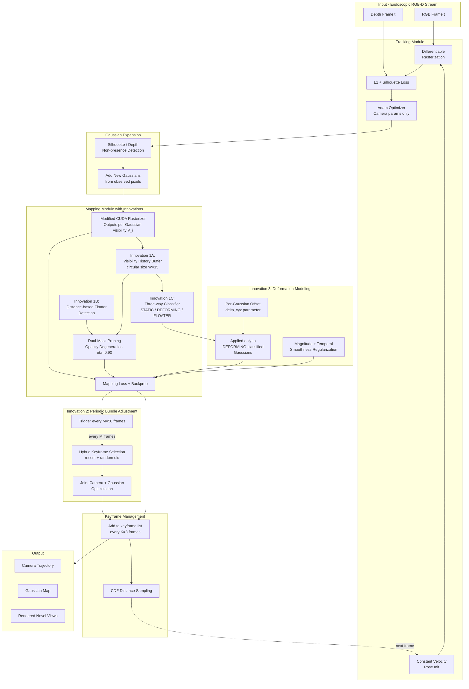

# Workflow Diagram for Tutor Meeting

This document gives you (1) a Mermaid flowchart you can render to an image and paste into the PPT, (2) a textual description of each block, and (3) what to highlight when presenting.

---

## 1. Mermaid diagram (paste into https://mermaid.live or GitHub README to render)

---

## 2. Block-by-block explanation (use as speaker notes)

### Block 1 — Input
RGB-D frames from the endoscope at 30-60 fps. Standard input matching the C3VD and StereoMIS datasets.

### Block 2 — Tracking
Standard EndoGSLAM tracking. Camera pose is initialized via constant velocity from previous two frames, then refined for 15 iterations using a combined photometric+depth loss with silhouette-guided masking. **Only camera parameters get gradients** — Gaussians are frozen during tracking.

### Block 3 — Gaussian Expansion
After tracking, new Gaussians are created in regions where the silhouette is below threshold or where rendered depth disagrees significantly with observed depth. This grows the map into newly explored areas.

### Block 4 — Mapping with Innovation 1 (this is the heart of our contribution)
- **Modified CUDA rasterizer** outputs a per-Gaussian visibility score V_i = sum over pixels of (alpha · transmittance). This is computed during normal rendering at zero extra cost via a single atomicAdd in the kernel.
- **Visibility history buffer** — for each Gaussian, store the last W=15 visibility values in a circular buffer.
- **Distance-based floater detection** — project each Gaussian to image plane, compare its z-depth to observed depth. If significantly in front, mark as floater (GS-SLAM Eq. 9).
- **Dual-mask pruning** — combine visibility-floater (low mean V_i) with distance-floater. Don't hard-delete; multiply opacity by η=0.90 (gradual). Standard opacity threshold then sweeps fully-faded Gaussians.
- **Three-way classifier** — based on visibility statistics: STATIC (high mean, low variance), DEFORMING (high mean, high variance), FLOATER (low mean). The DEFORMING label feeds Innovation 3.

### Block 5 — Innovation 2 (Periodic Bundle Adjustment)
Every 50 frames, jointly optimize camera poses and Gaussians over 5 selected keyframes for 20 iterations. Hybrid selection mixes recent keyframes with random older ones. Uses conservative camera learning rates (half of tracking rates) to avoid destabilizing converged poses. Adds ~1.5% overhead.

### Block 6 — Innovation 3 (Deformation Modeling)
Per-Gaussian position offset δ_xyz applied **only** to Gaussians classified as DEFORMING by Innovation 1's classifier. Regularized by magnitude penalty and temporal smoothness. Currently disabled on C3VD (rigid scenes); will be evaluated on StereoMIS.

### Block 7 — Keyframe Management
Standard distance-based CDF sampling for selecting keyframes during mapping iterations (EndoGSLAM convention).

### Block 8 — Output
Camera trajectory (for ATE evaluation), final Gaussian map (saved as .npz), and rendered novel views (PSNR/SSIM/LPIPS).

---

## 3. What to emphasize in the meeting

When presenting this diagram, structure your speech around three layers:

1. **Backbone (white/grey blocks)**: "This is the standard EndoGSLAM pipeline I built on. Tracking → Expansion → Mapping → Keyframe management."

2. **Our innovations (colored blocks)**: "These three colored regions are where I added contributions. The key technical enabler is the modified CUDA rasterizer that exposes per-Gaussian visibility — everything else builds on this signal."

3. **Information flow story**: "The visibility score V_i flows from the rasterizer through the history buffer into both pruning (Innovation 1) and the deforming/static classifier (which then drives Innovation 3). The bundle adjustment (Innovation 2) is independent but synergistic — it cleans up pose drift that otherwise creates floater Gaussians."

If the tutor asks "what's truly new vs prior work," your answer should be:
- *Innovation 1A* (CUDA-level per-Gaussian visibility for SLAM): not done in published work for endoscopy
- *Innovation 1B* (dual-mask combining visibility + depth): combination is novel
- *Innovation 1C* (three-way classifier driving deformation): genuinely new
- *Innovation 2* (BA in EndoGSLAM specifically): SplaTAM/GS-SLAM have BA but EndoGSLAM does not; small contribution
- *Innovation 3*: similar to NRGS-SLAM (Feb 2026); we're racing the literature here
